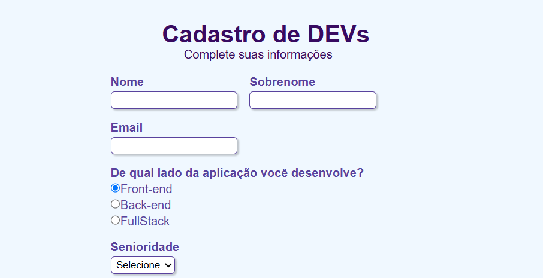

<h1 align="center">Cadastro de Desenvolvedores</h1>

Formulário de cadastro para desenvolvedores criado com HTML e CSS, permitindo o preenchimento de informações profissionais, tecnologias utilizadas e área de atuação..

## Funcionalidades
- Cadastro de nome e sobrenome.
- Campo para e-mail.
- Seleção da área de atuação:
    - Front-end
    - Back-end
    - Full Stack
- Seleção de nível de senioridade.
- Escolha de tecnologias utilizadas.
- Campo para descrição da experiência profissional.
- Layout responsivo e organizado.

## Tecnologias
- HTML5
- CSS3

## Conceitos Praticados
- Estruturação semântica com HTML5.
- Formulários web.
- Inputs de texto.
- Radio Buttons.
- Checkboxes.
- Select (listas suspensas).
- Textarea.
- Organização visual com CSS.
- Responsividade.

## Objetivo

Projeto desenvolvido para praticar a criação de formulários completos e a estilização de interfaces web utilizando HTML e CSS.

## Projeto Online
<a href="https://kauanemota.github.io/cadastro-devs/">Ver projeto online</a>

## 👩‍💻 Autor

Feito por Kauane Mota

🔗 GitHub: https://github.com/kauanemota
